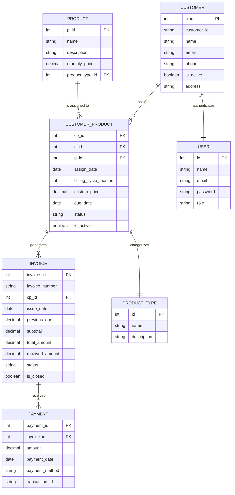
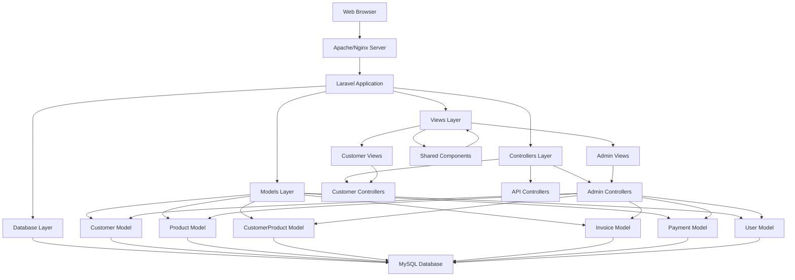
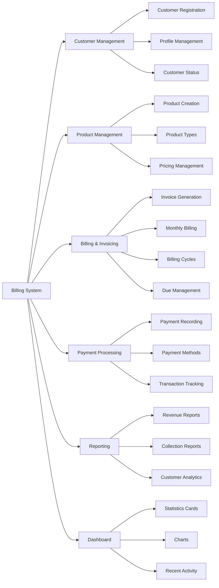
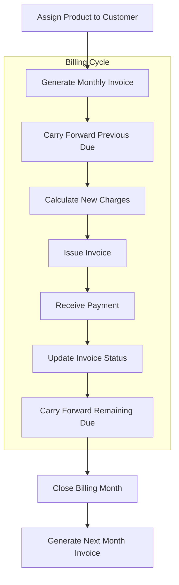

# Corporate Billing System - Project Architecture

## Overview
This document provides a visual representation of the corporate billing system architecture, showing the relationships between key components.

## Entity Relationship Diagram



## System Architecture Diagram



## Key Features Module Diagram



## Billing Flow Diagram



## Directory Structure

```
corporate-billing-system/
├── app/
│   ├── Http/Controllers/
│   │   ├── Admin/
│   │   │   ├── BillingController.php
│   │   │   ├── CustomerController.php
│   │   │   ├── ProductController.php
│   │   │   ├── CustomerProductController.php
│   │   │   └── DashboardController.php
│   │   └── Customer/
│   ├── Models/
│   │   ├── Customer.php
│   │   ├── Product.php
│   │   ├── CustomerProduct.php
│   │   ├── Invoice.php
│   │   └── Payment.php
│   └── Services/
├── resources/views/
│   ├── admin/
│   │   ├── billing/
│   │   ├── customers/
│   │   ├── products/
│   │   └── dashboard.blade.php
│   └── customer/
├── routes/
│   └── web.php
├── database/
│   └── migrations/
└── public/
```

## Technology Stack

- **Backend**: Laravel PHP Framework
- **Frontend**: Blade Templates, Bootstrap, jQuery
- **Database**: MySQL
- **Build Tool**: Vite
- **Authentication**: Laravel Auth
- **Styling**: Sass/CSS

## Key Relationships

1. **Customer - Product**: Many-to-many through CustomerProduct pivot table
2. **CustomerProduct - Invoice**: One-to-many (one customer product can generate multiple invoices)
3. **Invoice - Payment**: One-to-many (one invoice can receive multiple payments)
4. **Product - ProductType**: Many-to-one (many products belong to one type)
5. **Customer - User**: One-to-one (each customer has one user account for authentication)

This architecture supports flexible billing cycles, automatic due carry-forward, and comprehensive reporting capabilities.